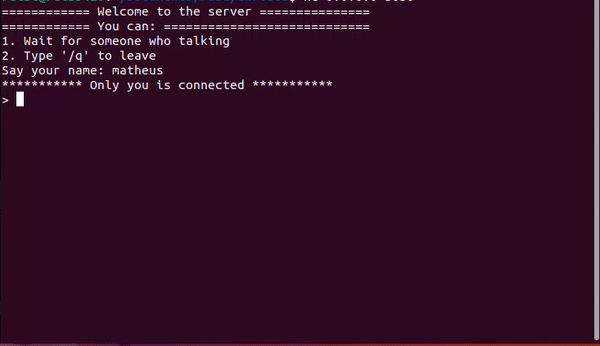

# rust_chat

This project was made to I learn a bit more about threads and tcp listener in Rust and this is not finished yet.

### How to execute:

First, you need to clone the project and have rust installed in your machine.
After this, enter in project directory and run:

```bash
cargo run
```

With server running, you can try connect in another terminal or another machine:

```bash
nc 127.0.0.1 3030  # another terminal

nc <your-local-ip> 3030 # another pc 
```


